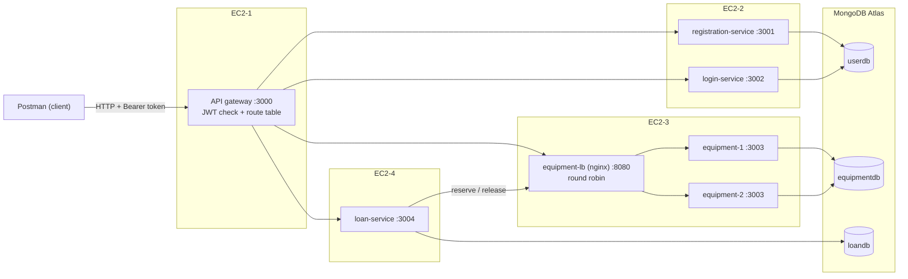

# EquipHub: Campus Equipment Lending

EquipHub lets students borrow shared campus equipment (cameras, laptops, projectors, audio
gear) and lets IT staff manage the inventory and approve, reject and close loans. It is a
backend-only microservices system: an API gateway, four services and an nginx load
balancer, each in its own Docker container, with MongoDB Atlas as the database. It is
deployed on four AWS EC2 instances and tested with Postman.

- **Roles:** `admin` (IT staff) and `user` (student)
- **Authentication:** JWT, issued by login-service and checked only at the gateway
- **Authorization:** one route table in the gateway decides which role may call which route
- **Tech:** Node.js 24, Express 5, Mongoose 8, MongoDB Atlas, Docker, nginx, Postman

## Architecture



Clients only ever talk to the gateway. The gateway checks the token and the role, then
sends the request on to the right service with trusted `x-internal-key`, `x-user-id`,
`x-user-role` and `x-user-email` headers. Every service refuses requests that don't carry
the internal key ("Direct access is not allowed"), and each service uses only its own
database. Design decisions are explained in [docs/ARCHITECTURE.md](docs/ARCHITECTURE.md).

## Services

| Service | EC2 | Port | URL (local / EC2) | APIs |
|---|---|---|---|---|
| gateway | EC2-1 | 3000 | `http://localhost:3000` / `http://<EC2-1-PUBLIC-IP>:3000` | every route below, after the JWT and role check |
| registration-service | EC2-2 | 3001 | `http://registration-service:3001` / `http://<EC2-2-PRIVATE-IP>:3001` | `POST /register/userregister`, `POST /register/admin` |
| login-service | EC2-2 | 3002 | `http://login-service:3002` / `http://<EC2-2-PRIVATE-IP>:3002` | `POST /auth/login` |
| equipment-lb (nginx) | EC2-3 | 8080 | `http://equipment-lb:8080` / `http://<EC2-3-PRIVATE-IP>:8080` | round robin to equipment-1 and equipment-2 |
| equipment-service (x2) | EC2-3 | 3003 | only through equipment-lb | `POST/GET /equipment`, `GET/PUT/DELETE /equipment/:id`, internal reserve/release |
| loan-service | EC2-4 | 3004 | `http://loan-service:3004` / `http://<EC2-4-PRIVATE-IP>:3004` | `POST /loans`, `GET /loans/me`, `GET /loans`, `GET /loans/overdue`, `PATCH /loans/:id/approve`, `reject`, `cancel`, `return` |

Every service also has `GET /health`. Inside Docker, services reach each other by service
name (local column); on EC2 they use private IPs. Only the gateway is public.

## Run it locally

You need Docker Desktop (running) and Node.js 24 (for the helper scripts).

1. Create every service's `.env` (it asks for your Atlas connection string and the first
   admin's password, and generates the shared secrets):

   ```bash
   ./scripts/setup-local-env.sh
   ```

   To write them by hand instead, each `<service>/.env` needs these lines (`KEY=value`, no
   quotes, no spaces around `=`):

   | Service | Variables |
   |---|---|
   | gateway | `PORT=3000`, `SERVICE_NAME=gateway`, `JWT_SECRET`, `INTERNAL_KEY`, `REGISTRATION_URL=http://localhost:3001`, `LOGIN_URL=http://localhost:3002`, `EQUIPMENT_URL=http://localhost:3003`, `LOAN_URL=http://localhost:3004` |
   | registration-service | `PORT=3001`, `SERVICE_NAME=registration-service`, `MONGO_URI` (ends with `/userdb`), `INTERNAL_KEY`, `ADMIN_EMAIL`, `ADMIN_PASSWORD` |
   | login-service | `PORT=3002`, `SERVICE_NAME=login-service`, `MONGO_URI` (ends with `/userdb`), `INTERNAL_KEY`, `JWT_SECRET`, `JWT_EXPIRES_IN=24h` |
   | equipment-service | `PORT=3003`, `SERVICE_NAME=equipment-service`, `INSTANCE_ID=equipment-1`, `MONGO_URI` (ends with `/equipmentdb`), `INTERNAL_KEY` |
   | loan-service | `PORT=3004`, `SERVICE_NAME=loan-service`, `MONGO_URI` (ends with `/loandb`), `INTERNAL_KEY`, `EQUIPMENT_URL=http://localhost:3003` |

   `INTERNAL_KEY` is the same in all five; `JWT_SECRET` is the same in the gateway and
   login-service. docker compose replaces the URLs and `INSTANCE_ID` with its own values.

2. Start the whole system (seven containers), in the foreground:

   ```bash
   docker compose up --build
   ```

   Wait until every container is healthy (`docker compose ps` in another terminal).
   Ctrl+C stops everything.

3. Check it:

   ```bash
   curl http://localhost:3000/health          # {"status":"ok","service":"gateway",...}
   curl -i http://localhost:3004/loans/me     # 403 "Direct access is not allowed" (no gateway)
   ```

Ports 3001, 3002, 3004 and 8080 are published only locally, to show that calling a service
directly is refused. On EC2 they aren't reachable from the internet at all.

## Deploy to EC2

The step-by-step guide is in [docs/DEPLOY.md](docs/DEPLOY.md). In short: push the images
with `./scripts/build-and-push.sh` (builds for x86, pushes `vnak3/<name>:v1.0`), then on each
instance put its `.env` next to `deploy/ec2-N-<name>/docker-compose.yml` and run
`sudo docker compose pull && sudo docker compose up -d`.

## Test with Postman

1. Import `postman/EquipHub.postman_collection.json` and one environment:
   `postman/local.postman_environment.json` (baseUrl `http://localhost:3000`) or
   `postman/ec2.postman_environment.json` (set baseUrl to `http://<EC2-1-PUBLIC-IP>:3000`).
2. In the environment, set `adminPassword` (Current value) to `ADMIN_PASSWORD` from
   `registration-service/.env`.
3. Run `node scripts/make-expired-token.js` and paste the output into `expiredToken`.
4. Run the folders in order: **1. Auth, 2. Equipment CRUD, 3. Loan flows, 4. Load balancer,
   5. Negative tests**. Every request has tests; login and create requests save tokens and
   ids for the requests after them.

What to screenshot for the submission is listed in
[docs/SCREENSHOT_CHECKLIST.md](docs/SCREENSHOT_CHECKLIST.md).

## Repository layout

```
equipment-lending-microservices/
├── docker-compose.yml        the whole system, locally
├── gateway/                  API gateway (route table, JWT check, forwarding)
├── registration-service/     sign-up, admin creation, first admin from .env
├── login-service/            login, JWT
├── equipment-service/        inventory CRUD, atomic reserve/release
├── loan-service/             loans, lifecycle, reserve/release with compensation
├── nginx/                    equipment load balancer (nginx.conf + Dockerfile)
├── deploy/                   one docker-compose.yml per EC2 instance
├── postman/                  collection and environments
├── scripts/                  setup-local-env.sh, build-and-push.sh, make-expired-token.js
└── docs/                     ARCHITECTURE.md, DEPLOY.md, SCREENSHOT_CHECKLIST.md
```

The four services behind the gateway share one layout: `server.js` (setup, `/health`, error
handler, graceful shutdown), `config/db.js`, `models/`, `routes/`, `middleware/`, a
`Dockerfile` and a `.dockerignore`. The gateway has no database; its role rules are in
`routeTable.js`. Secrets live only in `.env` files, which are never committed; the variables
they need are listed above (locally) and in [docs/DEPLOY.md](docs/DEPLOY.md) (on EC2).
