# EquipHub architecture

EquipHub follows the **three-tier architecture** from the course:

- **Presentation tier:** Postman, the client. There is no frontend.
- **Application tier:** the API gateway and the four services, each in its own container.
- **Data tier:** MongoDB Atlas, with one database per service area.

The gateway is the **middleware** between the client and the services: it is the single
entry point, it checks who the caller is, it applies the role rules, and it routes each
request to the right service.

## The microservices

All URLs are given for the local setup (inside Docker, where services find each other by
name) and for EC2 (placeholders for your instance IPs). "Who" is enforced by the gateway's
route table; a service never sees a request the gateway didn't allow. Every service also
has `GET /health` (no token, no internal key), returning `{ status, service, instance }`.

### API gateway

- Port **3000**
- Local: `http://localhost:3000`; EC2: `http://<EC2-1-PUBLIC-IP>:3000` (public)
- Database: none

It exposes exactly these routes and nothing else (`gateway/routeTable.js`):

| Method | Path | Who | Forwarded to |
|---|---|---|---|
| POST | `/register/userregister` | anyone | registration-service |
| POST | `/auth/login` | anyone | login-service |
| POST | `/register/admin` | admin | registration-service |
| POST | `/equipment` | admin | equipment (through equipment-lb) |
| GET | `/equipment` | admin, user | equipment |
| GET | `/equipment/:id` | admin, user | equipment |
| PUT | `/equipment/:id` | admin | equipment |
| DELETE | `/equipment/:id` | admin | equipment |
| POST | `/loans` | user | loan-service |
| GET | `/loans/me` | user | loan-service |
| GET | `/loans` | admin | loan-service |
| GET | `/loans/overdue` | admin | loan-service |
| PATCH | `/loans/:id/approve` | admin | loan-service |
| PATCH | `/loans/:id/reject` | admin | loan-service |
| PATCH | `/loans/:id/cancel` | user | loan-service |
| PATCH | `/loans/:id/return` | admin | loan-service |

### registration-service

- Port **3001**, database `userdb`, collection `users`
- Local: `http://registration-service:3001`; EC2: `http://<EC2-2-PRIVATE-IP>:3001` (only EC2-1)

| Method | Path | What it does | Success |
|---|---|---|---|
| POST | `/register/userregister` | Body `{ name, email, password, role, phone }`. Creates a student. `role` can be left out or `user`; `admin` gets 403. | 201 + the user (never the password) |
| POST | `/register/admin` | Body `{ name, email, password, phone }`. Creates an admin (admin-only at the gateway). | 201 |

On startup it creates the first admin from `ADMIN_EMAIL` and `ADMIN_PASSWORD`, but only if no
admin exists yet. Errors: 400 (validation, password under 6 characters), 403 (admin on the
public route), 409 (email already registered).

### login-service

- Port **3002**, database `userdb`, collection `users`
- Local: `http://login-service:3002`; EC2: `http://<EC2-2-PRIVATE-IP>:3002` (only EC2-1)

| Method | Path | What it does | Success |
|---|---|---|---|
| POST | `/auth/login` | Body `{ email, password, role }`. Checks the bcrypt hash and returns a JWT whose payload is `{ id, email, role }`, valid for `JWT_EXPIRES_IN` (24h). | 200 `{ token, user }` |

A wrong email, password or role all get the same 401 "Invalid email, password or role".

### equipment-service (two replicas) and equipment-lb

- Replicas on port **3003** (`equipment-1`, `equipment-2`), database `equipmentdb`,
  collection `equipment`
- Reached only through **equipment-lb** (nginx) on port **8080**:
  local `http://equipment-lb:8080`; EC2 `http://<EC2-3-PRIVATE-IP>:8080` (only EC2-1 and EC2-4)

| Method | Path | What it does | Success |
|---|---|---|---|
| POST | `/equipment` | Body `{ name, category, description, totalQty }`. `availableQty` starts at `totalQty`; any value the client sends is ignored. | 201 |
| GET | `/equipment` | Lists items; optional `?category=camera` and `?available=true`. | 200 `{ count, equipment }` |
| GET | `/equipment/:id` | One item. | 200 |
| PUT | `/equipment/:id` | Changes name, category, description and/or totalQty. `availableQty` moves with `totalQty`; 409 if the new total is below the units currently out. | 200 |
| DELETE | `/equipment/:id` | Deletes an item; 409 while any unit is reserved or lent out. | 200 |
| PATCH | `/internal/equipment/:id/reserve` | Loan only: takes one unit; 409 "Out of stock" if none is left. | 200 + the item |
| PATCH | `/internal/equipment/:id/release` | Loan only: gives one unit back, never above `totalQty`. | 200 |

Every response includes `instance` (`equipment-1` or `equipment-2`), so you can see which
replica answered. The gateway never routes `/internal/*`.

### loan-service

- Port **3004**, database `loandb`, collection `loans`
- Local: `http://loan-service:3004`; EC2: `http://<EC2-4-PRIVATE-IP>:3004` (only EC2-1)

| Method | Path | What it does | Success |
|---|---|---|---|
| POST | `/loans` | Body `{ equipmentId, days }` (1 to 7). Reserves a unit, then saves a pending loan for the caller. | 201 |
| GET | `/loans/me` | The caller's loans, newest first. | 200 |
| GET | `/loans` | All loans; optional `?status=pending` (or approved, rejected, cancelled, returned). | 200 |
| GET | `/loans/overdue` | Approved loans past their `dueDate`. | 200 |
| PATCH | `/loans/:id/approve` | pending → approved; `dueDate` = now + `days`. | 200 |
| PATCH | `/loans/:id/reject` | pending → rejected; the unit goes back. | 200 |
| PATCH | `/loans/:id/cancel` | The owner's pending loan → cancelled (someone else's: 403); the unit goes back. | 200 |
| PATCH | `/loans/:id/return` | approved → returned; `returnedAt` = now; the unit goes back. | 200 |

Rules: at most 3 active (pending or approved) loans per student, never two active loans for
the same item (409), `days` from 1 to 7 (400), and an invalid id anywhere gives 400.

## Design decisions

### 1. Data ownership: a database per service

Each service owns its data and is the only one that reads or writes it: `userdb` for the
auth services (registration and login share the `users` collection: one data area, split
into two services as the assignment asks), `equipmentdb` for equipment and `loandb` for
loans. No service ever reads another service's database. When Loan needs something from
Equipment, it asks over HTTP. That's why a loan stores `equipmentId` as a plain string, not
a Mongoose `ref`: you can't join across two databases owned by two services.

### 2. Reserve and release, with compensation

Borrowing touches two services and two databases, so there is no single transaction that
covers both. Instead the loan service runs a short sequence and undoes its own work if a
later step fails (a **compensating action**):

```mermaid
sequenceDiagram
    participant P as Postman
    participant G as Gateway
    participant L as loan-service
    participant E as equipment (via nginx)
    P->>G: POST /loans (Bearer token)
    G->>L: POST /loans + x-user-id, x-internal-key
    Note over L: 1. Check days, the 3-loan limit and duplicates (loandb)
    L->>E: 2. PATCH /internal/equipment/:id/reserve
    E-->>L: 200 + item (one atomic -1)
    Note over L: 3. Save the loan with the item's name
    alt saving fails
        L->>E: 4. PATCH .../release (compensation)
        L-->>G: 500 (or 409 for a duplicate)
    else saved
        L-->>G: 201 pending loan
    end
    G-->>P: same status and body
```

If Equipment is down or slow (3-second timeout), nothing is reserved and nothing is saved:
the client gets 503 "Equipment service unavailable". When a loan ends, the unit is
released; if that release fails, the loan goes back to its previous status and the client
gets 503, so stock is never lost.

### 3. The equipment name is copied into the loan (denormalized on purpose)

The reserve response contains the item, and the loan keeps a copy of its name. Listing loans
then never needs a call to the equipment service, and a loan keeps the name the item had when
it was borrowed. Copying a little data is the normal price of keeping services independent.

### 4. Atomic updates instead of read-then-write

Every change that depends on the current state happens in one conditional MongoDB update,
so two requests at the same moment can't both win:

- Reserve: `findOneAndUpdate({ _id, availableQty: { $gt: 0 } }, { $inc: { availableQty: -1 } })`.
  Two students racing for the last unit: one gets it, the other gets 409 "Out of stock".
- Release only matches while `availableQty < totalQty`; delete only while every unit is back.
- Changing `totalQty` is one update pipeline that checks the units currently out and shifts
  `availableQty` by the same amount.
- Loan status changes match on the current status, e.g. `{ _id, status: "pending" }`. A
  double-click on Approve, or Approve racing Cancel, applies only once; the loser gets 409.
- A partial unique index allows only one active loan per student per item, which also
  catches two "Borrow" clicks arriving together.

### 5. The JWT is checked only at the gateway

login-service signs the token; the gateway verifies it on every request (signature, expiry,
HS256 only) and checks the role against the route table: the only place role rules live.
Anything not in the table gets 404 (**deny by default**), and `/internal/*` is never routed.
The status codes are deliberate: **401** means "I don't know who you are" (token missing,
invalid or expired, each with its own message); **403** means "I know you, but you aren't
allowed" (wrong role).

The gateway then builds a **new** request for the service with only headers it sets itself
(`x-internal-key`, `x-user-id`, `x-user-role`, `x-user-email`). A client can't fake those
headers, because the client's own headers are never passed on. The services check the
internal key, so calling them directly (skipping the gateway) gets 403.

### 6. Load balancing: scaling the application tier

The equipment service runs as two identical replicas behind nginx. nginx sends requests to
them in turn (**round robin**), and every response shows its `instance`, so Postman and the
logs show the turns. This is horizontal scaling: more copies of a stateless service, with all
state in the database. The replicas publish no ports, so nothing can skip the load balancer.
A shared memory zone makes all nginx workers share one turn order. Docker health checks
start nginx only after both replicas are healthy, and nginx has its own health endpoint so
health checks don't use up turns.

### 7. Configuration in environment variables (12-factor)

Settings and secrets come from the environment, never from code: each service has a `.env`
(never committed); README.md and DEPLOY.md list the variables each one needs. Non-secret settings that
differ between local and EC2 (service URLs, `INSTANCE_ID`) are set in the compose files'
`environment:`. The same image runs locally and on EC2; only the environment changes. Every
`MONGO_URI` ends with its database name (otherwise MongoDB silently uses `test`), and every
service refuses to start if a required variable is missing.

### 8. Production-ready containers

- Pinned base images (`node:24-alpine`, `nginx:1.30.2-alpine`), never `latest`.
- **Docker layer caching:** `package*.json` is copied before the source, so `npm ci` reruns
  only when dependencies change, not on every code edit.
- `npm ci --omit=dev`: exactly the versions in `package-lock.json`, without dev tools.
- The app runs as the unprivileged `node` user.
- `CMD ["node", "server.js"]` plus `init: true`: stop signals reach Node directly, and every
  `server.js` shuts down gracefully (finishes current requests, closes the database).
- Health checks on `/health`, restart policies on EC2, one log line per request with the
  service or replica name, and errors always as JSON `{ "message": "..." }` with the right
  status code (400, 401, 403, 404, 409, 503).

### 9. Security

- Passwords are stored only as bcrypt hashes and never returned.
- Every wrong login gets the same message, and a missing account still runs a bcrypt compare,
  so neither the message nor the timing reveals which emails exist.
- The public sign-up route only creates students. The first admin comes from `.env`; after
  that, only an admin can create admins.
- Each instance's security group only lets in the instances that need it; only the gateway
  is public.
